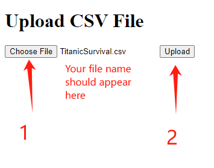
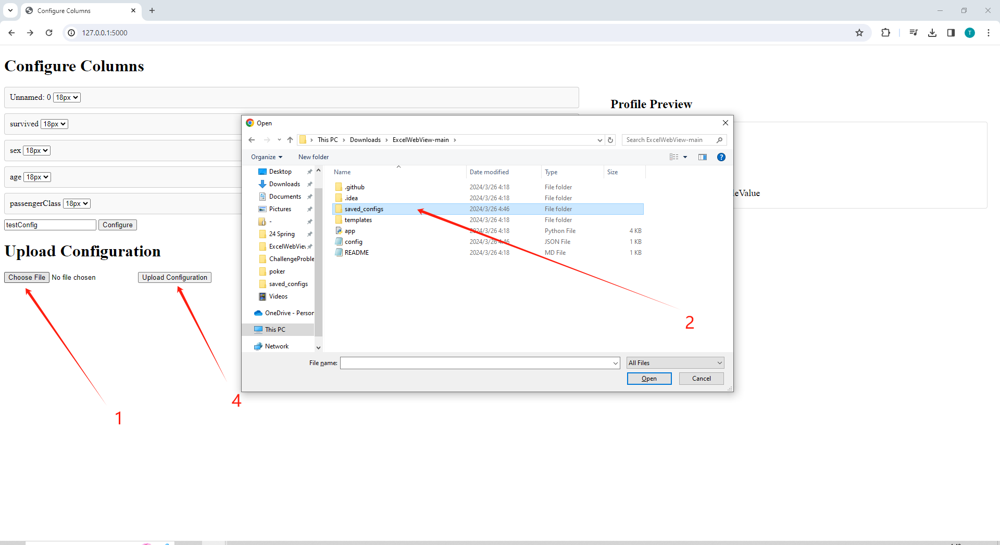

# ExcelWebView
Provides a simple customizeable view for excel spreadsheet

## Setup
1. Download the most recent version of python from https://www.python.org/downloads/

2. Download this project as zip and unzip

3. Find the path to where the project is installed

4. Open a command prompt and navigate to the path from the previous step using `cd [path]`

5. Copy the following commands to command prompt and run to download dependencies:
   1. `python -m pip install flask`
   2. `python -m pip install pandas`
6. Copy `python app.py` to command prompt and run to start the program (Do not close this command prompt)

7. Navigate to http://127.0.0.1:5000/ to use the program

## Using Excel Web View
1. Upload your Excel spreadsheet or a csv file and press the upload button: \

2. Configure your profile look for each row in the spreadsheet

3. Work in progress...url ending in success_page indicates success, use back arrow to return

5. Reload a previous configuration

## Closing the program
1. Return to the command prompt and press ctrl+C to exit the program. Do not worry, your configuration is saved!

